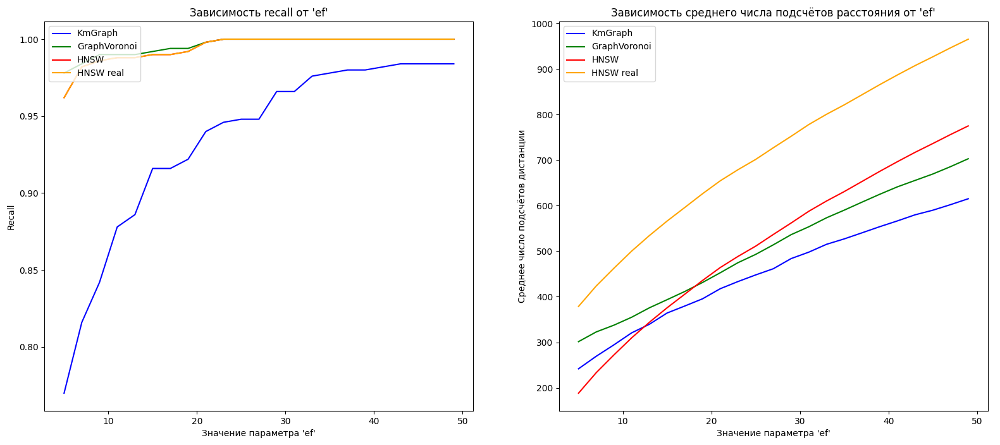
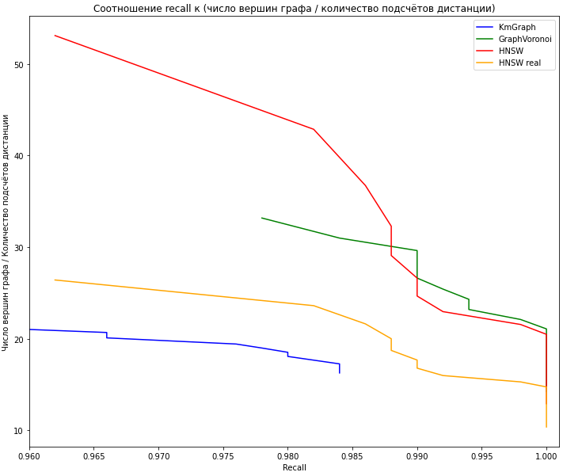

# Navigable Graphs Python
Python based research tool for studying navigable graphs for nearest neighbour search


## Подготовка данных
* Скачивание sift датасета:
```
python ./download_dataset.py --dataset "sift1m" --output_dir "./datasets"
```


## Тестирование
* На сгенерированных данных:
```
python ./test_each_graph.py --dataset synthetic --K 40 --k 5 --dim 30 --n 2000 --nq 100 --ef 40 --M 32 --M0 64
```
* На датасете sift:
```
python ./test_each_graph.py --dataset sift --K 40 --k 5 --ef 30 --M 32 --M0 64
```

**P.S.:**
* Запуск скриптов проводить из корневой папки репозитория.
* Перед запуском рекомендовано закомментировать графы, что не нужны в рассмотрении.
* Для построения графиков необходимо раскомментировать соответствующий блок в файле ```test_each_graph.py```.


## Результаты
При запуске ```python ./test_each_graph.py --dataset sift --K 40 --k 5 --ef 30 --M 32 --M0 64``` получились следующие результаты:
* Для KmGraph средний recall: 0.9480, среднее число подсчётов расстояния: 468.8.
* Для GraphVoronoi средний recall: 1.0000, среднее число подсчётов расстояния: 546.55.
* Для HNSW средний recall: 1.0000, среднее число подсчётов расстояния: 574.74.
* Для HNSW real средний recall: 1.0000, среднее число подсчётов расстояния: 765.09.

Ниже представлены графики изменения метрики recall и среднего числа вызовов функции подсчёта расстояния в зависимости от параметра ```ef``` при настройках ```--dataset sift --K 40 --k 5 --M 32 --M0 64```.

